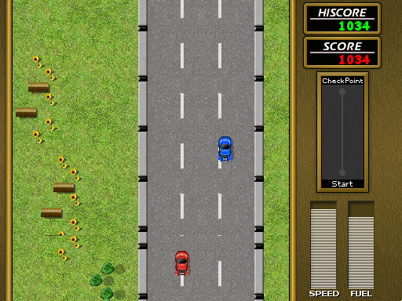

roadfighter
====

This version of RoadBlaster from BrainGames as been slightly modified. It now support Pandora and ODROID build.
To compile on the Pandora, using the Codeblocks Command Line PND, just type
`make`

To compile on the ODROID, type
`make ODROID=1`

To compile on x86 Linux, type
`make LINUX=1`

Other platform can probably be added easily (like RPi), but will need some slight 
changes in the Makefile (contact me or do a pull request if you want / have a new platform)

Note that you will need SDL_sound library (for SDL1.2). You can find a copy of this lib (that can be built both for SDL1.2 and SDL2) [here](https://github.com/ptitSeb/SDL_sound). Don't forget to configure with `--enable-sdl2=no` if using this version.

The original readme (with detailed how to play) can be found [here](readme.txt)
